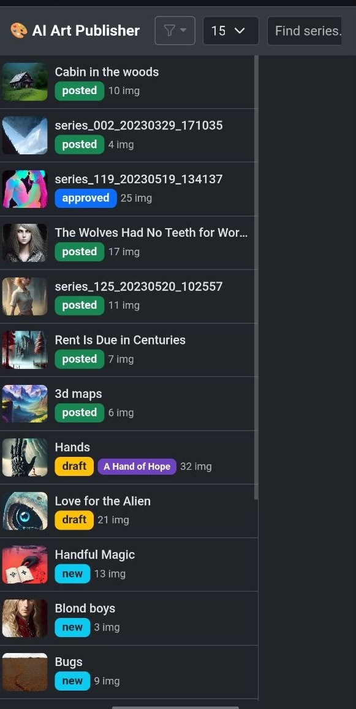
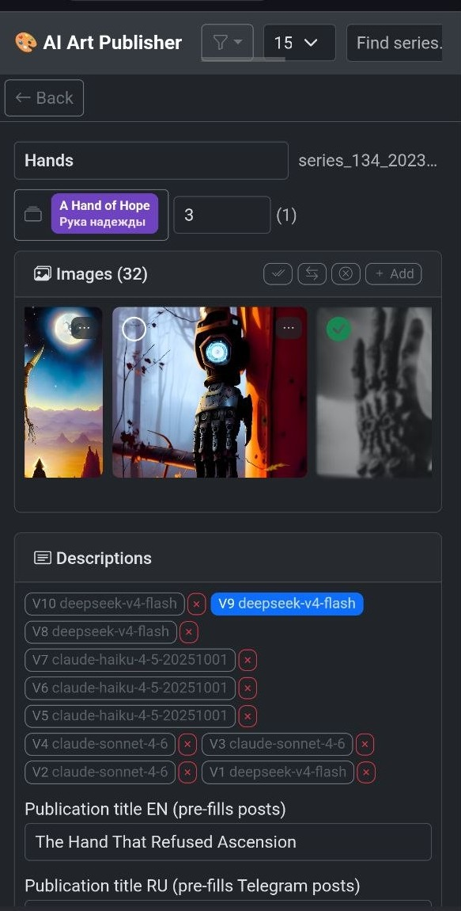
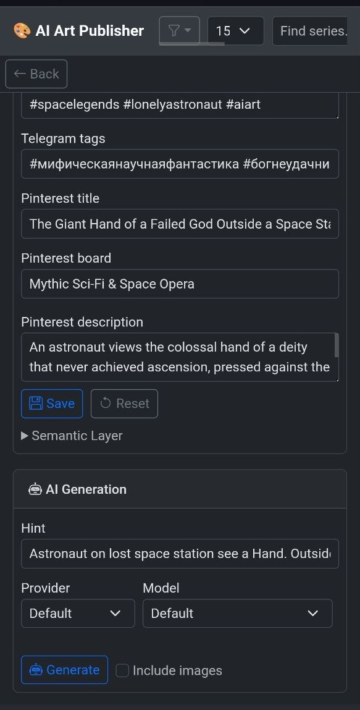
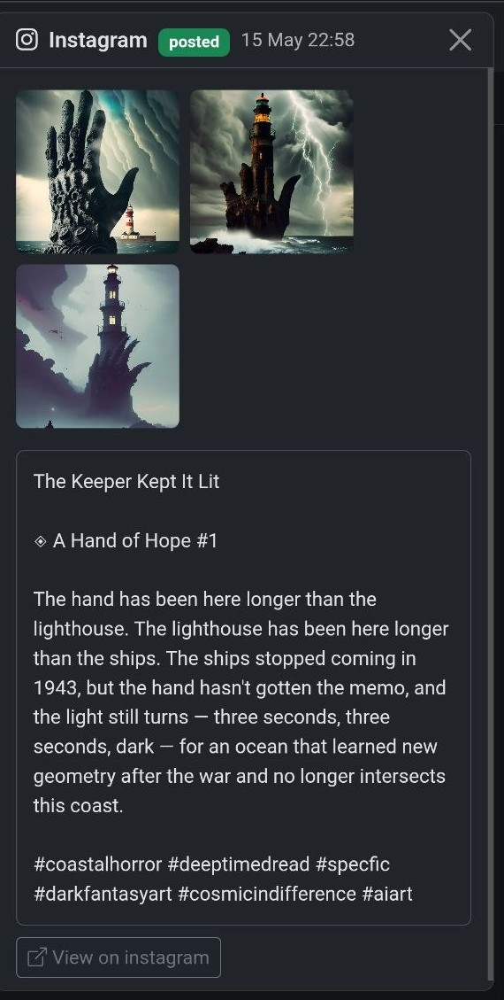

# AI Art Publisher

**[https://ai-art-publisher.fly.dev](https://ai-art-publisher.fly.dev)**

A personal web tool for managing AI-generated image series and publishing them to social media. Built to streamline an actual creative workflow: import images, generate platform-ready captions via LLM, curate and edit, then post or schedule to Telegram, Instagram, Pinterest, and Facebook.

Runs 24/7 on [Fly.io](https://fly.io/) with scheduled posting and is accessible from any device (phone, tablet, laptop) via browser.

## Screenshots

<p>
  
  
  
  
</p>

---

## Table of Contents

- [Screenshots](#screenshots)
- [Why I Built This](#why-i-built-this)
- [Key Features](#key-features)
- [Tech Stack](#tech-stack)
- [Architecture](#architecture)
- [Technical Highlights](#technical-highlights)
- [Trade-offs and Design Decisions](#trade-offs-and-design-decisions)
- [Getting Started](#getting-started)
- [Environment Variables](#environment-variables)
- [Available Commands](#available-commands)
- [Deployment](#deployment)
- [Status Flows](#status-flows)
- [Bulk Import](#bulk-import)
- [Obtaining a Long-Lived Facebook Access Token](#obtaining-a-long-lived-facebook-access-token)
- [Testing AI Generation Locally](#testing-ai-generation-locally)

---

## Why I Built This

I generate large batches of AI artwork and post them to social media. Doing this manually — formatting captions, translating them, writing hashtags, copying to Telegram, posting to Instagram — took 20–40 minutes per series. Over weeks it became unsustainable.

The available publishing tools (Buffer, Later, etc.) don't understand the content of the images and can't generate contextually appropriate captions. Standard LLM chat interfaces require constant copy-paste and lose state between sessions.

So I built a tool that:
- stores my image library in one place (Cloudflare R2)
- sends image batches to multiple LLM providers and generates complete platform-specific captions in one shot
- lets me pick the best variant, edit it, then post or schedule with a single click
- keeps running and fires scheduled posts even when my PC is off

> The tool intentionally keeps image selection and caption choice manual. The goal is not full automation, but an AI-assisted editorial workflow where generation removes blank-page friction while the final creative decision remains human.

---

## Key Features

- **Multi-series library** — organize images into series with Collections grouping; drag-and-drop reorder within a series
- **Multi-provider AI generation** — Anthropic Claude, OpenAI GPT, Google Gemini, DeepSeek; switch per-request, track cost per generation
- **Structured caption output** — each AI variant includes English and Russian titles/descriptions, Instagram hashtags, SEO phrase layer, Pinterest title/description/board, Telegram hashtags, and archive classification keywords
- **Variant selection** — generate 3 variants per series, compare them side-by-side, pick one as canonical, edit freely
- **Multi-platform posting** — Telegram (media group), Instagram (carousel), Pinterest (pin), Facebook (page post)
- **Scheduled posting** — set a date/time; APScheduler fires even when the browser is closed
- **Soft delete with Trash** — series and images go to Trash before permanent deletion; fully restorable
- **Image status workflow** — `pending → queued → posted / skip`; only queued images are sent in a post
- **Bulk import** — CLI script uploads existing image folders directly to R2 and registers them via API (resumable)
- **Settings UI** — manage all API keys and service credentials in-app without redeploying
- **Session cookie auth** — 30-day login via landing page form; Basic Auth header kept as fallback for API/curl; zero config for local dev (auth disabled when env vars unset)

---

## Tech Stack

| Layer | Technology |
|---|---|
| Backend | Python 3.12, FastAPI, SQLAlchemy 2 (SQLite + WAL) |
| Frontend | Vanilla JS (ES2022), Bootstrap 5.3, SortableJS |
| Image storage | Cloudflare R2 (S3-compatible, public bucket) |
| Hosting | Fly.io (256 MB VM, persistent volume for SQLite) |
| Scheduling | APScheduler 3.x (in-process, interval trigger) |
| AI providers | Anthropic Claude, OpenAI, Google Gemini, DeepSeek |
| Social APIs | Telegram Bot API, Instagram Graph API, Pinterest API v5, Facebook Graph API |
| Migrations | Alembic (18 versions and counting) |
| Testing | pytest, Playwright (E2E via browser), pytest-cov |
| CI/CD | GitHub Actions (test → deploy on push to `master`) |
| Linting/types | ruff, mypy |

---

## Architecture

### System Diagram

```
┌─────────────────────────────────────────────────────┐
│                    Browser (any device)              │
│         Vanilla JS + Bootstrap 5.3 SPA              │
└───────────────────────┬─────────────────────────────┘
                        │ HTTP (session cookie / Basic Auth fallback)
                        ▼
┌─────────────────────────────────────────────────────┐
│              Fly.io VM (256 MB, region: ams)        │
│                                                     │
│  ┌──────────────────────────────────────────────┐   │
│  │           FastAPI (uvicorn, 1 worker)        │   │
│  │                                              │   │
│  │  Routers: series · images · generate        │   │
│  │           posts · scheduling · settings     │   │
│  │           trash · collections · backup      │   │
│  │                                              │   │
│  │  ┌─────────────────┐  ┌──────────────────┐  │   │
│  │  │   SQLAlchemy 2   │  │   APScheduler   │  │   │
│  │  │  (SQLite + WAL)  │  │  (hourly tick)  │  │   │
│  │  └────────┬────────┘  └────────┬─────────┘  │   │
│  └───────────┼────────────────────┼────────────┘   │
│              │                    │                 │
│      ┌───────▼───────┐    Posts due?                │
│      │  SQLite DB    │◄───────────┘                 │
│      │ (persistent   │                              │
│      │  volume)      │                              │
│      └───────────────┘                              │
└──────────────────────┬──────────────────────────────┘
                       │
         ┌─────────────┼─────────────────────┐
         │             │                     │
         ▼             ▼                     ▼
  ┌─────────────┐  ┌──────────────┐  ┌─────────────────┐
  │   AI APIs   │  │  Cloudflare  │  │  Social APIs    │
  │             │  │     R2       │  │                 │
  │  Anthropic  │  │  (images,    │  │  Telegram       │
  │  OpenAI     │  │  public URL) │  │  Instagram      │
  │  Google     │  └──────────────┘  │  Pinterest      │
  │  DeepSeek   │                    │  Facebook       │
  └─────────────┘                    └─────────────────┘
```

### Directory Structure

```
app/
  main.py          — FastAPI app, router wiring, session auth middleware, landing page, lifespan
  database.py      — SQLAlchemy engine (SQLite WAL), init_db(), _run_migrations()
  models.py        — Collection, Series, Image, AIVariant, Post, PostImage, AppSettings ORM models
  schemas.py       — Pydantic request/response types
  config.py        — AppConfig (DATABASE_URL, DATA_DIR, AUTH_USERNAME, AUTH_PASSWORD, SESSION_SECRET, FAKE_POSTING, FAKE_AI, etc.)
  scheduler.py     — APScheduler background job (hourly, fires due scheduled posts)
  routers/
    series.py      — CRUD + list + delete; canonical serializers series_to_detail/image_to_resp
    images.py      — upload, register, reorder, move, PATCH status, DELETE (soft)
    generate.py    — AI description generation (multi-provider, variant storage)
    posts.py       — create/execute posts to Telegram/Instagram/Pinterest/Facebook
    scheduling.py  — schedule/cancel/queue endpoints
    settings.py    — AppSettings CRUD + connection test
    trash.py       — GET /api/trash, restore, permanent delete, empty trash
    collections.py — Collection CRUD + series assignment
    backup.py      — SQLite backup download endpoint (token-auth)
  services/
    storage.py     — R2StorageService (boto3, S3-compatible)
    ai/            — AIProvider ABC + Anthropic / OpenAI / Google / DeepSeek implementations
    telegram.py    — TelegramService.post_media_group()
    instagram.py   — InstagramService.post() (single + carousel)
    facebook.py    — FacebookService.post()
    pinterest.py   — PinterestService.post_pin()
  static/          — app.js, editor.js, posting.js, settings.js
  templates/       — index.html (Bootstrap 5.3 + SortableJS, dark theme)
alembic/
  versions/        — 18 migrations (001 through 018)
scripts/
  import_local.py  — bulk import CLI (direct R2 upload + API register)
  migrate.py       — DB migration entry point (used by Fly.io release_command)
  test_generation.py — local CLI for testing AI prompts
tests/             — pytest unit tests + Playwright E2E tests
```

### Data Model

```
Collection (1) ──── (N) Series (1) ──── (N) Image
                                  (1) ──── (N) AIVariant
                                  (1) ──── (N) Post (1) ──── (N) PostImage
AppSettings (singleton, id=1)
```

**Series** is the central entity. A series groups related images (e.g., one generation batch). Each series can have multiple AI-generated caption variants; the user picks one as canonical. A Post ties a series to a platform (telegram, instagram, etc.) and records which images were sent and the result.

---

## Technical Highlights

### Provider-Agnostic AI Layer

All four LLM providers implement a single `AIProvider` ABC in `app/services/ai/base.py`. The provider is selected at request time from `AppSettings.default_provider`. Adding a new provider means implementing one method: `generate_variants(images_b64, model, hint, num_variants)`. Cost tracking (USD per generation) is computed from token counts returned by each provider's API.

### Structured Prompt Engineering

The system prompt (`app/services/ai/base.py`) instructs the LLM to output a strict JSON schema covering seven fields per variant: bilingual titles, platform descriptions, Instagram SEO phrase layer, Pinterest metadata, archive classification keywords. The prompt is tuned for a specific aesthetic (speculative fiction, dark fantasy) to produce non-generic output — it explicitly names authors to emulate stylistically (Zelazny, Bradbury, Reynolds, Lovecraft) and lists patterns to avoid. LLM output is validated, and known provider-specific quirks (DeepSeek emitting unquoted hashtags, models wrapping JSON in markdown fences) are handled in `extract_json()`.

### Zero-Infrastructure Scheduling

APScheduler runs inside the FastAPI process — no Redis, no Celery, no separate worker. The scheduler fires every hour, queries posts with `status = "scheduled"` and `scheduled_at <= now`, and executes them in sequence. This works reliably on Fly.io because `auto_stop_machines = "suspend"` (the machine suspends but wakes on requests; the scheduler keeps it alive for the next tick). The tradeoff: `--workers 1` in production is a hard constraint; multiple workers would each start a scheduler and post duplicates.

### SQLite in Production

SQLite with WAL mode is used in a genuine production deployment (not just for demos). This was a deliberate choice for a single-user tool: no separate DB process, no connection pooling, zero ops overhead, and the database is a single file on a Fly.io persistent volume with automated daily backups via GitHub Actions.

### Frontend Without a Framework

The frontend is ~1700 lines of vanilla JS across four files with no build step and no npm dependency. `h(tag, props, ...children)` is a minimal DOM builder defined in `app.js` — every UI element is constructed with it. This was a deliberate choice: the UI is complex enough to benefit from structure but simple enough that a framework would add more ceremony than it removes. A security hook in the project actively blocks `innerHTML` writes to prevent XSS from inadvertent string concatenation.

### Fake Backends for Testing

`FAKE_POSTING=true` and `FAKE_AI=true` environment flags make the generate and posting endpoints return stub responses without any API calls. E2E tests spin up a real `uvicorn` subprocess on port 18765 with both flags set — tests exercise the full HTTP stack, the real SQLite engine, and the real Playwright browser, with only the external API calls stubbed at the boundary.

### Alembic Migration Safety

`scripts/migrate.py` handles both fresh installs and upgrades. On a fresh DB it calls `create_all` + `stamp head` (schema created without running migrations one-by-one). On an existing DB it runs `upgrade head`. The script is the `release_command` in `fly.toml`, so it runs before each new deployment version starts taking traffic.

---

## Trade-offs and Design Decisions

| Decision | Why | What it costs |
|---|---|---|
| SQLite instead of PostgreSQL | Zero ops, single file, easy backup, single-user tool | Must run `--workers 1`; can't scale horizontally |
| APScheduler in-process | No separate worker infra, no Redis | Hard `--workers 1` constraint; scheduler stops if the process crashes (Fly.io restarts it automatically) |
| Vanilla JS, no build step | Instant iteration, no toolchain to maintain, no dependency churn | No TypeScript, manual DOM management, harder to test UI components in isolation |
| R2 public bucket (no proxy) | Images served at CDN speed with zero bandwidth cost on the app server | Images are publicly accessible via URL; acceptable for published artwork |
| Single `AppSettings` DB row | Settings editable in-app without env-var redeployment | Settings are plaintext in SQLite; environment variables take precedence on first boot only |
| Soft delete for all entities | Nothing is immediately destroyed; trash panel for recovery | DB rows accumulate; `empty trash` is the only cleanup path |
| 18 Alembic migrations | Schema evolved iteratively as the tool grew; each migration is a clear audit trail | Migration file count grows over time |

---

## Getting Started

### Prerequisites

- Python 3.12+
- [uv](https://docs.astral.sh/uv/) (recommended) or pip
- Cloudflare R2 bucket (public) — for image storage
- At least one AI provider API key

### Setup

```bash
# Clone
git clone https://github.com/anscii/ai-art-publisher.git
cd ai-art-publisher

# Create venv and install dependencies
uv venv .venv --python=python3.12
uv pip install -r requirements.txt -r requirements-dev.txt

# Install Playwright browser (needed for E2E tests only)
.venv/bin/playwright install chromium

# Install pre-commit hooks
make hooks

# Copy env template and fill in values
cp .env.example .env

# Apply DB migrations (creates SQLite file on first run)
make migrate

# Run tests
make test-back    # fast — no browser
make test-front   # E2E — requires Playwright

# Start dev server
make run
# Open http://localhost:8000
```

Auth is disabled when `AUTH_USERNAME` / `AUTH_PASSWORD` are not set — `GET /` goes straight to the app in local dev. In production with auth configured, unauthenticated visitors see the public landing page.

---

## Environment Variables

### Required for core functionality

| Variable | Description |
|---|---|
| `DATABASE_URL` | SQLAlchemy URL — defaults to `sqlite:///./data/db.sqlite` |
| `DATA_DIR` | Directory for local file storage — defaults to `./data` |

### AI providers (at least one required)

| Variable | Description |
|---|---|
| `ANTHROPIC_API_KEY` | Anthropic Claude API key |
| `OPENAI_API_KEY` | OpenAI API key |
| `GOOGLE_API_KEY` | Google Gemini API key |
| `DEEPSEEK_API_KEY` | DeepSeek API key |

### Cloudflare R2

| Variable | Description |
|---|---|
| `R2_ENDPOINT` | `https://<account_id>.r2.cloudflarestorage.com` |
| `R2_ACCESS_KEY` | R2 access key ID |
| `R2_SECRET_KEY` | R2 secret access key |
| `R2_BUCKET` | Bucket name |
| `R2_PUBLIC_BASE_URL` | Public base URL e.g. `https://pub-xxx.r2.dev` |

Set `LOCAL_STORAGE=true` to skip R2 entirely and store uploads in `DATA_DIR/uploads/` — useful for offline dev.

### Social platforms (all optional)

| Variable | Description |
|---|---|
| `TELEGRAM_BOT_TOKEN` | Bot token from @BotFather |
| `TELEGRAM_CHANNEL_ID` | Channel username e.g. `@mychannel` |
| `INSTAGRAM_ACCESS_TOKEN` | Long-lived Page access token |
| `INSTAGRAM_USER_ID` | Instagram Business account ID |
| `FACEBOOK_PAGE_ID` | Facebook Page ID |
| `FACEBOOK_PAGE_ACCESS_TOKEN` | Facebook Page access token |
| `PINTEREST_ACCESS_TOKEN` | Pinterest OAuth access token |

### Auth and ops

| Variable | Default | Description |
|---|---|---|
| `AUTH_USERNAME` | _(unset)_ | Basic Auth username; unset = no auth |
| `AUTH_PASSWORD` | _(unset)_ | Basic Auth password |
| `SESSION_SECRET` | _(unset)_ | HMAC key for session cookies; derived from `AUTH_PASSWORD` if unset |
| `FAKE_POSTING` | `false` | Skip real API calls in posting routes |
| `FAKE_AI` | `false` | Return stub AI variants without API calls |
| `SCHEDULER_SECRET` | _(unset)_ | Token for `/internal/scheduler/trigger` endpoint |
| `BACKUP_TOKEN` | _(unset)_ | Token for `/internal/backup-db` download endpoint |
| `LOG_LEVEL` | `INFO` | Python logging level |

All API keys can also be set via the Settings UI (⚙️) after first boot — they are stored in the `AppSettings` DB row. Environment variables take precedence on first boot only.

---

## Available Commands

```bash
# Development
make run            # dev server with auto-reload (http://localhost:8000)
make test           # full suite: unit + E2E
make test-back      # backend unit tests only (fast, no browser)
make test-front     # E2E browser tests only
make check          # format + lint + typecheck + tests
make format         # ruff format
make lint           # ruff check + format diff
make types          # mypy
make migrate        # apply DB migrations
make migrate-new msg="add foo column"  # create new Alembic migration

# AI generation test
make test-prompt hint="glowing cathedral half-submerged in a frozen sea"
make test-prompt hint="..." provider=openai model=gpt-4o-mini
```

---

## Deployment

The app is deployed to Fly.io. Push to `master` triggers GitHub Actions → `fly deploy`.

### First deploy

```bash
# Install flyctl
curl -L https://fly.io/install.sh | sh
fly auth login

# Create app (say NO to overwrite fly.toml)
fly launch --no-deploy --name ai-art-publisher

# Create persistent volume for SQLite (1 GB)
fly volumes create app_data --size 1 --region ams

# Set secrets
fly secrets set \
  AUTH_USERNAME="yourname" \
  AUTH_PASSWORD="strong-password" \
  ANTHROPIC_API_KEY="sk-ant-..." \
  R2_ENDPOINT="https://<account_id>.r2.cloudflarestorage.com" \
  R2_ACCESS_KEY="..." \
  R2_SECRET_KEY="..." \
  R2_BUCKET="ai-gallery" \
  R2_PUBLIC_BASE_URL="https://pub-xxx.r2.dev" \
  TELEGRAM_BOT_TOKEN="..." \
  TELEGRAM_CHANNEL_ID="@yourchannel"

# Deploy
fly deploy
```

DB migrations run automatically as the `release_command` before the new version starts serving traffic.

### Useful Fly.io commands

```bash
fly status                # VM status
fly logs                  # live logs
fly ssh console           # SSH into the VM
fly volumes list          # check volume usage (stay under 1 GB)
fly scale memory 512      # upgrade RAM if needed

# Inspect DB on the VM
fly ssh console
sqlite3 /app/data/db.sqlite "SELECT status, count(*) FROM series GROUP BY status;"
```

---

## Status Flows

### Series

```
new → draft → approved → scheduled → partial_posted → posted
 └─────────────────────────────────────────────────→ skip
```

| Status | Meaning |
|---|---|
| `new` | Freshly imported, not reviewed |
| `draft` | Work in progress |
| `approved` | Ready to post |
| `scheduled` | Queued for automatic posting at a set time |
| `partial_posted` | Some images posted; remaining images still pending |
| `posted` | All selected images published |
| `skip` | Won't post; hidden from list by default |

### Image

| Status | Meaning |
|---|---|
| `pending` | Default; not yet assigned to a post |
| `queued` | Selected for the next post |
| `posted` | Already published (dimmed in strip) |
| `skip` | Excluded; greyed-out, won't be posted |

Only `queued` images are sent when you trigger a post. After posting, queued images become `posted` automatically.

Deleted series and images go to **Trash** first (soft delete via `deleted_at` timestamp). Restore or permanently delete from the Trash panel.

---

## Bulk Import

Import existing image folders in bulk. Images upload directly to R2 (bypassing the app server); only metadata goes through the API. The script is resumable — safe to interrupt and re-run.

```bash
.venv/bin/python scripts/import_local.py \
  --source /path/to/series_folders \
  --app-url https://ai-art-publisher.fly.dev \
  --workers 8
```

Expected folder structure:

```
series_folders/
  series_001_20230315_142300/
    1678901234_out.jpg
    1678901235_out.jpg
  series_002_.../
    ...
```

R2 credentials are read from `.env`. Timestamps are parsed from filenames automatically. All imported series get status `new`.

---

## Obtaining a Long-Lived Facebook Access Token

Instagram posting via the Graph API requires a **Page access token**. Short-lived tokens expire in ~1 hour; the steps below exchange for a ~60-day token.

**Prerequisites:** a Facebook Developer app with `pages_read_engagement` and `instagram_basic` / `instagram_content_publish` permissions; admin or editor access to the Page linked to your Instagram Business account.

**1. Get a short-lived Page token**

```bash
curl -X GET \
  "https://graph.facebook.com/v25.0/{USER_ID}/accounts?access_token={USER_ACCESS_TOKEN}"
```

Copy the `access_token` from the response.

**2. Exchange for a long-lived token**

Open [Access Token Debugger](https://developers.facebook.com/tools/debug/accesstoken/), paste the short-lived token, click **Debug**, then **Extend Access Token**.

**3. Set the token**

```bash
fly secrets set INSTAGRAM_ACCESS_TOKEN="<long-lived-token>"
```

Or update it in the Settings UI (⚙️) without redeploying. The app does not auto-renew expiring tokens.

---

## Testing AI Generation Locally

Test prompts without opening the browser:

```bash
.venv/bin/python scripts/test_generation.py \
  --hint "glowing cathedral half-submerged in a frozen sea, red aurora overhead"

# Override provider/model
.venv/bin/python scripts/test_generation.py \
  --hint "..." --provider openai --model gpt-4o-mini --variants 1
```

`--provider` and `--model` default to `DEFAULT_PROVIDER` / `DEFAULT_MODEL` from `.env`.
